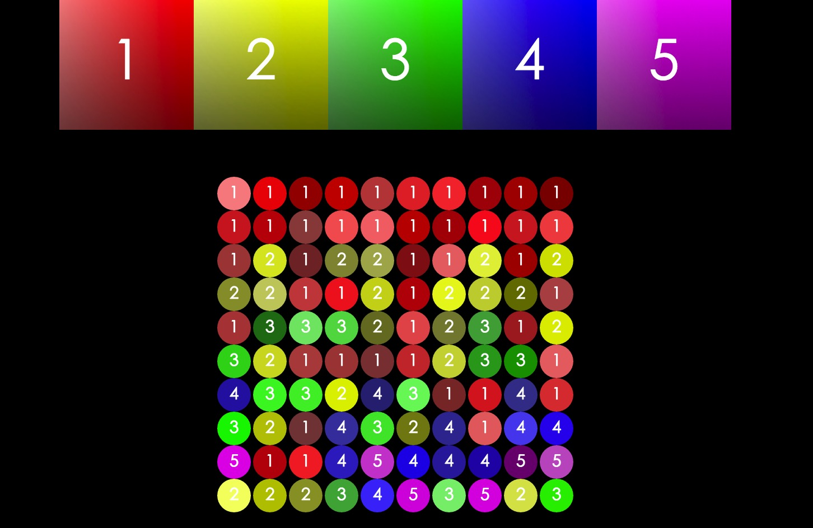

#A demo for predicting entity

* 请使用Makefile编译代码
* 使用下面示例给出的命令启动程序
* 本demo的输入为一个带entity的数据集和一个未知entity的查询集
* 运行demo之后可以根据数据集的entity预测查询集中每个数据对应的entity
* entity可以理解为一种分类，头衔，标签等能够描述一个数据对象区别于其他数据对象的内容

###示例:

make
./medrank -n 58951 -d 3 -qn 100 -ds ./data/color-d.txt -qs ./data/color-q.txt

###参数说明:
* -n: 数据集的大小
* -d: 向量的维度
* -qn: 查询集的大小
* -ds: 数据集的文件路径
* -qs: 查询集的文件路径

###如果要改用其他数据集，请确保数据文件都为文本文件，并且满足以下格式:
每个文件中包含若干个对象，每个对象为一个d维的向量 
数据集(-ds)每一行的格式为 
type dimVal-1 dimVal-2 ... dimVal-d 
其中type为该向量所属的entity，dimVal-n(n=1,2,...,d)分别为每个维度的值 
查询集(-qs)每一行的格式为 
dimVal-1 dimVal-2 ... dimVal-d 
dimVal-n(n=1,2,...,d)分别为每个维度的值

###demo使用数据说明:
数据集来自/check/img文件夹下的5张图片。每张图片都是一个颜色的大类，包含多个像素点，每个像素点的RGB颜色值都不一样。将5张图片上的像素全部提取之后得到5种类别的数据，每个数据都是一个3维的向量，代表其RGB颜色值。这里entity即是颜色大类，一共有5种大致颜色(红，黄，绿，蓝，紫)。数据对象RGB颜色深浅不同，因此每个大类包含多种颜色。
查询集的数据则是随机生成的RGB颜色值，数据量为100。demo将根据输入的查询集的向量，预测出该颜色属于哪种大类。

###结果展示:
程序运行结束之后将工作目录切换到check文件夹下，编译convert.cpp并执行
g++ convert.cpp -o convert
./convert
convert运行结束之后check文件夹下会出现一个color.txt文件，将color.txt文件的内容复制之后粘贴到color_show.js文件中注释的地方，在浏览器中打开color_show.html即可看到预测结果。预测结果如下图所示

######(hongchh_sysu@qq.com)