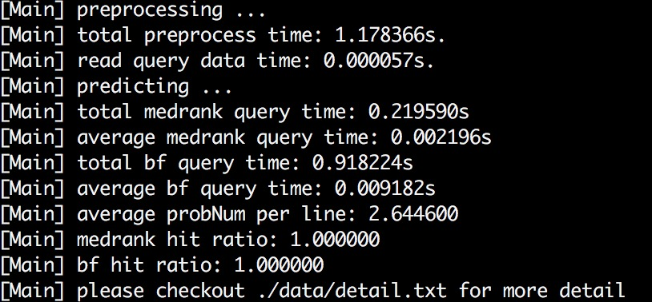
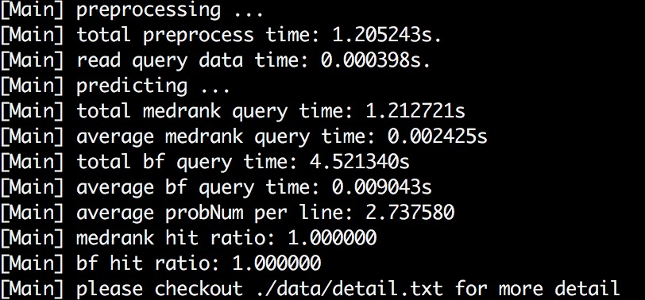
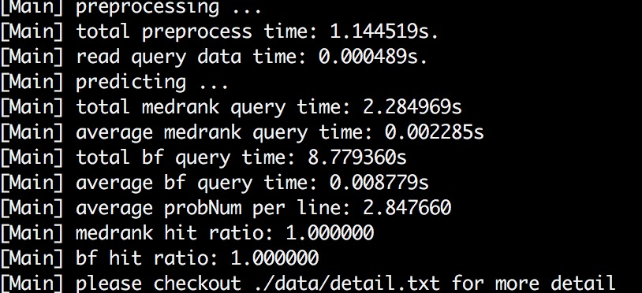
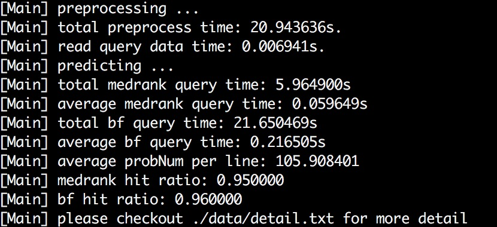
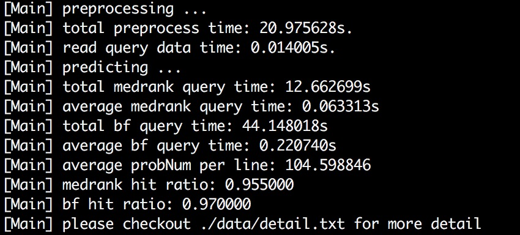
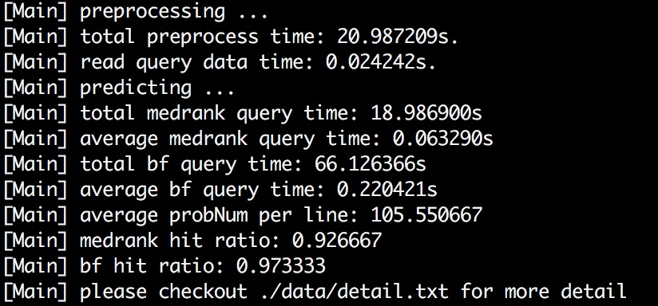

#A model for entity predicting

##前言

实体(entity)是描述一些数据对象区别于其他数据对象的内容，可以理解为一种类型、标签。在实际应用场景中，实体可以是商标、品牌、公司名称等等，类似于搜索引擎中的关键字，但也有所区别。实体过滤(entity filtering)指的是，在某些带有实体标记的数据中，过滤出与查询实体相关的数据。比如：有大量的微博博文数据，将博文内容按照“BMW”、“KFC”、“剑桥大学”、“哈佛大学”等不同实体进行了分类，接着给定一个查询实体“BMW”，则从数据中过滤出与BMW相关的数据出来。实体过滤可以用于调查监控某些品牌或者机构的网络知名度和影响力，为企业战略调整提供参考，及时调整发展方向等等。以上便是我们小组所选择的论文【1】中所做的事情，作者提出一种机器学习的算法，该算法可应用于实体过滤，数据输入之后通过该算法的特殊筛选方式再配合人工打上实体标签，可以快速得到一个带有不同实体标签的数据集。

从本质上来看，实体过滤是一个实体到数据的过程，通俗一点讲就是你给我一个实体，我给你一堆跟实体相关的数据供你去做其他分析。论文【1】提出的模型会产生一个带有不同实体标签的数据集，将此数据集仅用于作实体过滤未免有点浪费资源。于是我们小组提出的改进方案是对此模型做一个功能上的改进，增加一个数据到实体的过程，即你给我数据，我来预测该数据可能与哪些实体相关。我们把这个过程称为实体推断，或者实体预测。我们也考虑了增加这个从数据到实体的过程是否有现实意义，最终我们一致认为，增加从数据到实体这个过程是有现实意义的。从小的方面讲，我们可以通过监测社交网络上的某个用户的数据，再将此数据经过我们的模型计算得到其相关的实体，我们统计这些实体之后便可知晓这个用户关注的事物，从而可用于为兴趣分析、爱好推荐等系统提供参考。从大的方面讲，我们可以检测名人机构的社交网络数据来监测他们的关注动向。

最后，从实体到数据和从数据到实体这两个过程可能比较难理解清楚，我们打算再给出一个例子用于简要说明实体过滤和实体推断的区别，便于您更进一步了解我们论文所做的事情，该例子也会在后面的实验中被用于检验模型的正确性。例子如下：有红色、黄色、绿色、蓝色、紫色5种颜色大类。拿红色来说，红色下面可以包含品红、朱红、粉红、浅红、猩红等等很多种红，这些颜色的差别就是红的深浅程度不一样，更具体一点说就是RGB颜色值不一样，但他们给人的直观视觉感受就是红色。因此，我们把这种广泛意义上的颜色分类(红色、黄色、绿色等)称为颜色实体，具体的RGB颜色值称为颜色数据，例如“红色”称为颜色实体，“粉红-rgb(255,192,203)”称为颜色数据。实体过滤做的事情就是当查询实体为“红色”时，返回rgb(255,192,203)、rgb(220,20,60)等直观上看起来是红色的具体的颜色数据。而实体推断做的事情就是给定具体的颜色数据，例如rgb(255,192,203)，返回该数据所属的颜色实体“红色”。

##问题定义

我们要解决的是实体推断的问题，该问题可以描述为：给定一个已知实体标签的大的数据集和一个未知实体标签的数据集，将前者称为训练集，后者称为查询集。将训练集作为输入经过特定算法处理之后得到一个模型，该模型可以接受来自查询集的输入，并对查询集中的每个数据对象都预测其所属的实体标签。

算法的输入为一个训练集(ds)和一个查询集(qs)，训练集的大小为n，查询集合的大小为qn。

训练集是一个带有实体标签的数据集，包含多个(大量)数据对象，每个数据对象都用特征向量的形式表示，向量的维度为d，每一个数据对象的格式如下:

type dimVal-1 dimVal-2 ... dimVal-d

其中，type为该数据对象所属的实体类型(实体取值范围有多个，{e1, e2, e3, e4, e5, ..., ek})，dimVal为数据对象的特征向量每个维度上的值。

查询集是一个普通的数据集，该数据集包含多个数据对象，每一个数据对象都用特征向量的形式表示，向量的维度也是d，并且这些数据对象是未知实体的，即他们所属的实体未知。每一个数据对象格式与训练集一样。

由于数据量较大，算法的两个输入均采用文件输入，在使用算法的过程中需要提供训练集的大小n、训练集的数据文件路径ds、查询集的大小qn、查询集的数据文件路径qs、特征向量的维度大小d这5个参数。

算法的输出为预测的结果。对于查询集中的每一个数据对象q[i]，预测其可能属于的实体e，将e输出到文件保存。

##算法描述

前置知识：空间中向量之间的距离可以使用欧氏距离来衡量，向量v1=(x1, x2, ..., xn)和向量v2=(y1, y2, ..., yn)之间的欧氏距离为dist=|v1-v2|=sqrt(sum((xi-yi)^2))(i=1, 2, ..., n)。本算法默认数据对象都采用特征向量的形式描述，对象之间的距离采用欧氏距离描述。

算法的总体思路是从训练集中选出跟查询的数据对象距离最近的N个点，通过计算这N个点所属实体出现的次数，将出现次数最多的实体作为查询的数据对象的预测实体。最简单的办法就是暴力查找，对每一个查询对象，遍历训练集的对象并计算与查询对象的距离，排序之后再取出距离最短的前N个点即可。基于数据量庞大，暴力算法会十分耗费时间和计算性能，是下下之策。我们采取的算法是medrank算法。

medrank算法是一种高效的查询大致最近邻点(ANN)的算法，通过选取合理的参数配置能够让其找到真正最近邻点。论文【2】中提出的medrank算法是一种查询一个邻近点的算法，我们对算法进行了改造，使得它能够找到N个邻近点。改造后的算法大致步骤如下(medrank算法的流程在论文【2】中已有详细介绍，篇幅较长，这里不再重复描述，如想要深入理解medrank算法请参考论文【2】，下面只展示我们改进后的medrank算法):

在一个d维的向量空间，按照正态分布的规律随机取出m条直线[L1, L1, ..., Lm]，每条直线的单位向量为[a1, a2, ..., am]。预处理的时候将训练集的向量投影到这m条直线上面去，即每条直线上会有n个投影值。用下面这种形式描述第i条直线上训练集的投影值[vi-1, vi-2, ..., vi-j, ..., vi-n]，i=1, 2, 3, ..., m，j=1, 2, 3, ..., n，i表示第几根直线，vi-j表示训练集中第j个对象在第i条直线上的投影。接下来，m条直线将扮演m个投票者的角色。给定一个查询向量，我们将查询向量也投影到m条直线上去得到投影值[q1, q2, ..., qm]。对于每一根直线Li，根据训练集在这条直线上的投影值vi-j与查询点在这条直线上的投影值qi的距离大小来进行投票。投票的规则如下，假设第i条直线上训练集的投影值为[vi-1, vi-2, ..., vi-n]，查询点的投影值为qi，从第i条直线上训练集的投影值中找出与qi的距离最近的两个投影值vi-hi和vi-li使得vi-hi <= qi <= vi-li，从这两个值开始，每次迭代都投给距离qi最近的点一票，不断向两边展开，如下面图1所示。以此类推，每根直线都是如此不断循环迭代下去，直到有N个点的票数超过投票者数量的一半，即m/2，则结束算法。这些票数超过一半的点就是我们想要的N个最近邻点。算法的伪代码如下图2所示，其中MINFREQ是论文【2】里为medrank算法设定的一个参数用于限定算法的结束条件，我们设置它为0.5，代表有N个点票数超过投票者的一半(0.5)就停止算法。向量的投影可以简单由需要投影的向量v跟投影直线的单位向量a作一个向量内积来完成，即投影值p = v * a。

<pre>
-----------------------------------------------------------
medrank
-----------------------------------------------------------
Input: 查询对象q
Output: 训练集中与q最近的N个邻近点
for i = 1 to m do
    qi = ai * q
    初始化两个指针hi和li使得vi-hi <= qi <= vi-li且hi和li指向的点离qi最近
end
S = 空集, f = [0, 0, ..., 0]
while S中满足(f > MINFREQ*m)的点的数量小于N do
    for i = 1 to m do
        if |vi-hi - qi| < |vi-li - qi| then
            c = ci-hi;
            hi = hi - 1;
        else
            c = ci-li;
            li = li + 1;
        end
        if S不包含c then
            把c加入S并初始化f[c] = 1;
        else
            f[c] = f[c] + 1;
        end
    end
end
return S中满足(f > MINFREQ*m)的点;
-----------------------------------------------------------
</pre>

我们知道，在信息检索和数据库领域中，处理的数据量都是非常庞大的，经常需要对数据建立索引。B+树索引的查询速度很快，访问的数据量很小，一般只需3-4次IO就能查询出所需的数据。为了更进一步提高程序的性能，我们使用B+树这种数据结构来优化查询效率。在medrank算法中，我们需要找出每条直线上投影值跟qi最近的两个点的指针li和hi，之后才是借由这两个指针向两侧扩展来进行投票。由于训练集数据量庞大，普通的线性查找或者二分查找比较耗时，而且当数据较大无法全部放进内存时，查找效率更是低下。因此，我们在这里可以利用B+树对每一条线上的投影值建立索引，在查找时利用索引进行查找，既能提高查找速度，又能降低数据访问量，一举两得。关于使用B+树索引的伪代码如下所示。

<pre>
------------------------------------------------------------
indexing
------------------------------------------------------------
Input: m条直线，每条直线上都有n个投影值
Output: None
for i = 1 to m do
    将第i条直线上的n个投影值排序;
    使用B+树的bulk-loading方法对排序后的投影值建立索引;
    将索引存储至磁盘文件;
end
------------------------------------------------------------

------------------------------------------------------------
finding
------------------------------------------------------------
Input: 查询点在第i根直线上的投影值qi
Output: 两个指针hi和li
利用B+树的范围查找功能找出两个指针hi和li使得*hi <= qi <= *li
return hi, li;
------------------------------------------------------------
</pre>

最后，我们将B+树和medrank算法结合起来之后得到的最终模型的伪代码如下图所示

<pre>
------------------------------------------------------------
preprocess
------------------------------------------------------------
Input: 训练集D的n个数据对象{o1, o2, ..., on}, 投影直线数量m
Output: None
利用正态分布生成m个随机单位向量{a1, a2, ..., am};
for j = 1 to m do
    Lj = 空集
end
for i = 1 to n do
    for j = 1 to m do
        ci-j = i;
        vi-j = aj * oi;
        Lj = Lj 并 (ci-j, vi-j);
    end
end
for j = 1 to m do
    将第j条直线上的n个投影值根据vi-j的大小从小到大进行排序;
    使用B+树的bulk-loading方法对排序后的投影值建立索引;
    将索引存储至磁盘文件;
end
------------------------------------------------------------

------------------------------------------------------------
medrank
------------------------------------------------------------
Input: 查询对象q
Output: 训练集中与q最近的N个邻近点
for i = 1 to m do
    qi = ai * q
    利用B+树的范围查找初始化两个指针hi和li使得vi-hi <= qi <= vi-li且hi和li指向的点离qi最近
end
S = 空集, f = [0, 0, ..., 0]
while S中满足(f > MINFREQ*m)的点的数量小于N do
    for i = 1 to m do
        if |vi-hi - qi| < |vi-li - qi| then
            c = ci-hi;
            hi = hi - 1;
        else
            c = ci-li;
            li = li + 1;
        end
        if S不包含c then
            把c加入S并初始化f[c] = 1;
        else
            f[c] = f[c] + 1;
        end
    end
end
return S中满足(f > MINFREQ*m)的点;
------------------------------------------------------------

------------------------------------------------------------
predict
------------------------------------------------------------
Input: 查询集Q的n个数据对象{q1, q2, ..., qn}
Output: 每个查询对应的实体标签{e1, e2, ..., en}
E = 空集
for i = 1 to n do
    调用medrank算法查找得到N个点points;
    mark = 空集
    for p in points do
        if mark中包含p.entity then
            mark[p.entity] = mark[p.entity] + 1;
        else
            将p.entity加入到mark并初始化mark[p.entity] = 1;
        end
    end
    将mark中值最大的实体标签取出加入到集合E中;
end
return E;
------------------------------------------------------------
</pre>

算法的主要步骤如上面所示，下面我们将逐个步骤进行描述。

预处理部分，预处理主要是将训练集的n个数据对象投影到m条直线上，记录投影值和投影点，即第几个点在第几条直线上的投影值。m条直线的产生，并不需要去确定直线方程，由于在算法中只需要对向量进行投影，因此，我们只需要生成m条直线对应的m个单位向量供投影使用即可。m个单位向量的生成需要满足正太分布，这样做的原因是为了让medrank算法的查询效果更好，具体细节在论文【2】中也有进行解释我们就不在重复赘述。投影完成后我们会得到m条直线，每一条直线上都有n个投影值。对每一条直线上的投影值都建立B+树索引，一共会产生m个索引。将这些索引存入文件，用于为medrank算法提供范围查询。

medrank算法部分，这部分基本步骤都跟前面介绍medrank算法时候所说的一致，便不重复赘述。相比之前的改动就只是在初始化指针hi和li的地方采用B+索引进行查询。训练集的数据量很大，这一步改进将显著提高查询速度，为整个算法的时间效率带来极大收益。

预测部分，这部分完成的工作是对输入的数据进行实体推断，也是体现我们解决实体推断问题的主要思想的地方。前面我们说到，进行预测需要先找到N个邻近点，再统计这些点所对应的实体标签。具体做法就是，对于输入的数据对象，首先通过调用medrank算法得到N个最邻近点，接着做一个O(N)的循环去统计这些邻近点的实体标签出现的次数，选取出现次数最多的实体标签作为预测结果。

##实验结果

我们做了两个实验，第一个实验使用的训练集是从下面5张图中提取出来的每个像素点的RGB颜色值。每一张图片都是一个颜色大类，包含多种RGB颜色。查询集则是随机提取的1000个RGB颜色值。训练集和查询集的每一个颜色值都将使用一个3维的特征向量来描述，代表其RGB颜色值。在demo的/check/img文件夹下可以找到这5张图片。

第二个实验使用的数据集为Mnist的数据集，详情可参考数据集的介绍和下载网站http://yann.lecun.com/exdb/mnist/ 。包括一个训练集和一个测试集，其中，训练集有60000个数据对象，测试集有10000个数据对象，每个数据对象都是一个784维的特征向量，每个特征向量都带有一个label。由于数据量庞大，测试时间会比较长，我们只提取了测试集中前300个数据对象作为我们实验的查询集。在demo中我们给出了一个get_mnist_data.cpp文件，有兴趣者请自行去修改里面相关参数来提取Mnist的全部测试数据来进行10000个数据的检验(需要比较暴力算法，暴力算法做10000个查询的时间会很长请耐心等候)。

实验的评价标准是检查输出的结果是否正确，是否能够返回正确的实体标签。因此，我们需要一个已知实体标签的查询集作为检验，为了达到这个目的，我们在实验一中采取的做法是在训练集中随机抽取适量的数据出来充当查询集，由于训练集的每个数据对象都是已知实体标签的，我们可以得到一个已知实体标签的查询集。将查询集的实体标签保存起来，再跟实验的输出结果进行比较，计算正确率。实验二中的查询集中每个数据对象都已经带有Mnist官方打上的label，将此标签作为区分对象的实体标签即可。实验过程中，我们还将对比使用b+树配合medrank算法和使用暴力查找算法的查询结果和查询开销，进而探究我们论文所使用的模型的正确性和优越性。

我们先来看第一个实验。第一个实验，我们要做的就是对于查询集中的每一个像素点，预测其所属的颜色大类。我们把上面5张图片代表的5种颜色大类分别打上实体标签“1”，“2”，“3”，“4”，“5”。每一个从对应图片中提取出来的像素点都带有其对应的实体标签。例如从红色图片中提取出来的像素点都将带有实体标签“1”。查询集中的每一个点输入之后，输出结果为该点所属的实体标签。比如rgb(255,192,203)为粉红色，输入之后得到的输出应该为“1”。我们收集100个查询点对应的输出，并制作了一个HTML页面用于显示对应的实验结果。实验结果展示请看下面的展示图，从实验结果来看，100个查询点的查询结果都是正确的，每一个点都能得到正确的实体标签来标记其所属的颜色大类。通过HTML页面从肉眼上也可以直观地看到实验结果的正确性。我们进行了查询集大小分别为100、500、1000的实验，最后得到的实验结果如下表所示。

|  item\size    |      100      |      500      |      1000     |
|:-------------:|:-------------:|:-------------:|:-------------:|
|preprocess     | 1.178366      | 1.205243      | 1.144519      |
|medrank(total) | 0.219590      | 1.212721      | 2.284969      |
|medrank(avg)   | 0.002196      | 0.002425      | 0.002285      |
|bf(total)      | 0.918224      | 4.521340      | 8.779360      |
|bf(avg)        | 0.009182      | 0.009043      | 0.008779      |
|medrank prob   | 2.644600      | 2.737580      | 2.847660      |
|hit ratio(m)   | 1.000000      | 1.000000      | 1.000000      |
|hit ratio(b)   | 1.000000      | 1.000000      | 1.000000      |

统计项:
* prepreocess: 预处理时间，包括读取训练集数据，向量投影，建立b+树索引的时间(单位: 秒)
* medrank(total): medrank算法完成n个查询的总时间(单位: 秒)
* medrank(avg): medrank算法完成1个查询的平均时间(单位: 秒)
* bf(total): 暴力算法完成n个查询的总时间(单位: 秒)
* bf(avg): 暴力算法完成1个查询的平均时间(单位: 秒)
* hit ratio(m): 使用medrank算法查询之后预测实体的正确率
* hit ratio(b): 使用暴力算法查询之后预测实体的正确率
* medrank prob: medrank算法平均每棵B+树索引的数据访问量(单位: 页; 页大小: 1KB)

从实验结果来看，使用medrank算法或者简单的暴力查找算法都能达到预期的正确率，这说明所使用的算法是合理的可行的，能够正确预测出查询对象所属的实体。并且，两种算法的命中率都是一样的，也就是说，正确性不相上下。我们再来看其他指标。medrank算法的查询时间很少，不管是数据量多大，平均每一个查询的时间都维持在0.0022秒左右，而暴力查找算法的时间则是维持在0.009秒左右。由此可见，medrank平均每个查询的查询速度要比普通的暴力查找算法快4倍左右。可能平均到一个查询的时间差距不大，我们来看总的查询时间，数据量为100的时候，medrank算法的总的查询时间为0.219秒，暴力查找的时间为0.918秒。随着数据量上升，差距逐渐增大，数据量上升到1000的时候，medrank算法的总查询时间为2.285秒，而暴力算法却需要8.779秒。显然，medrank算法具备强大的时间高效性，随着查询量的增加，时间差距累积扩大十分明显。最后一个指标是medrank算法的探测页面数量，我们计算了medrank算法在查找时访问的数据页面数量，发现平均每棵B+树只需访问2.74页，而本实验中一棵B+树索引的总大小为448页，计算一下便可知道，medrank算法在查找时需要访问的数据量仅为0.61%。而暴力算法需要遍历训练集所有数据，数据访问量为100%，使用建立B+树索引的方法显著降低了数据访问量，这也是medrank算法能够快速完成查询的重要原因之一。

接下来，我们来看第二个实验。第一个实验很明显是一个面向低维度数据的实验，在实际应用中，像社交网络数据之类的特征向量维度通常都是很高的。因此，我们来进一步检验我们的模型在高维度向量空间中的适用性。实验步骤与实验一类似，不过查询集的数据量变为100、200、300。实验的结果如下面表2所示

|  item\size    |      100      |      200      |      300      |
|:-------------:|:-------------:|:-------------:|:-------------:|
|preprocess     | 20.943636     | 20.975628     | 20.987209     |
|medrank(total) | 5.964900      | 12.662699     | 18.986900     |
|medrank(avg)   | 0.059649      | 0.063313      | 0.063290      |
|bf(total)      | 21.650469     | 44.148018     | 66.126366     |
|bf(avg)        | 0.216505      | 0.220740      | 0.220421      |
|medrank prob   | 105.908401    | 104.598846    | 105.550667    |
|hit ratio(m)   | 0.950000      | 0.955000      | 0.926667      |
|hit ratio(b)   | 0.960000      | 0.970000      | 0.973333      |

实验二的数据维度为784，可以看到，随着数据的维度增大，处理的时间跟随之变长，不过跟实验一有相同的规律。我们可以看到，medrank算法平均处理一个查询的时间为0.06秒左右，而暴力算法则是0.21秒左右，medrank算法比暴力算法快3.5倍(实验一是4，相差不大)。从总的查询时间来看，medrank算法在查询数据量为100时比暴力算法节省时间15.68秒左右，数据量上升到300时节省时间47.14秒左右。随着查询数据量增加，medrank算法带来的时间收益更加显著。medrank算法的平均每一棵B+树索引的页面访问量为105左右，实验二中B+树索引的大小为486页，数据访问量大概为21.6%。虽然相比实验一增加了不少，但还是明显少于暴力算法。最后我们来看一看命中率，medrank算法和暴力算法的命中率都挺高，在这个实验中虽然暴力算法的命中率更高一点点，但也差不了多少，而且预测存在误差也是合理的，用一点点误差换来性能上的大幅度提升，显然是收益远大于损失，而且能够达到92%~95%左右的命中率也是十分理想的。

最后，我们对比一下实验一跟实验二的数据访问量，仔细研究过论文【2】便可发现，medrank算法用来投影的m条直线，m的数值是自己合理确定的。在我们的的模型中，我们选择了100条直线来投影，主要目的是确保在高维度向量空间中的正确性(论文【2】中已指出增加投影线数量会增强medrank算法的查找效率)。增加投影线的数量会增加算法的时间开销，因此需要合理取舍选择恰当数量的投影线。经过测试之后我们觉得100根投影线既能确保正确率也能保证有较低的时间开销。显然，100根线，远远超过实验一的向量维度(3维)，这意味着很快就能投票产出合适的近邻点，因此实验一的数据访问量很低，在访问很少的数据量之后便能投票产生结果。而实验二的向量维度有784维，用100根投影线来投票需要循环更多次数，访问更多的数据页面。这也是为什么实验二比实验一的数据访问量高的原因之一。

##总结

我们实现了一个实体推断的模型，这个模型的主要思想很简单，只需要找寻合适数量的邻近点再统计出现次数最多的实体便可完成推断。该模型成立的前提条件是数据都可采用特征向量的形式描述并且存在一个已知实体标签的训练集。在整个实验过程中，我们做的大部分工作是在为这个简单的推断过程提高效率并且保持正确性。

通过整理实验结果，我们可以得出结论，通过统计邻近点的实体标签来进行实体推断的办法是可行的，该办法的推断结果正确率也很高。在我们的实验一中，正确率达到100%，当然，我们无法保证在任何应用场景下都能够有100%的正确性，就像实验二，但在实际应用中，推断本身也允许存在误差，只要误差在可接受的范围以内，从实验结果来看我们的模型的命中率还是很理想的。其次，b+树是在数据库和信息检索领域常用的数据结构，而medrank则是一种优秀的查询邻近点的算法。使用b+树配合medrank算法可以高效地完成工作，建立b+树索引的方式能够显著降低数据访问量，提高查询效率，使得查询速度非常快，数据访问量很小，从时间和空间上都节省了很多开销。

通过本次实践，我们提出了解决实体推断问题的一种可行的方案，并且使用b+树配合medrank算法优化了查询效率，最后，我们通过进行多个实验验证方案的可行性。我们学习到了面对一个问题如何提出一种可行的解决方案，如何优化方案，如何验证方案的可行性。在优化过程中，学会了如何选择算法和数据结构，选取medrank算法之后对medrank算法的改造，使得它能够查询N个近邻点，这一过程也让我们更深入地理解medrank算法，学会了如何从理解算法过渡到将其改造应用到实际的场景中。在验证模型对于低维度和高维度数据的适用性的过程中，我们学会了从多个方面验证结论的科学方法。最后，从训练集中提取部分数据得到一个可验证的查询集，这种验证方法是从论文【1】中学习到的，我们不仅收获多一种验证方式，也学会了从他人的论文中汲取优秀办法。

##参考文献
【1】Damiano Spina, Maria-Hendrike Peetz, Maarten de Rijk,《active learning for entity filtering》

【2】R. Fagin, R. Kumar, and D. Sivakumar, 《efficient similarity search and classification via rank aggregation》

##附录

####实验环境:
* 操作系统: MacBook Pro OS X 10.11.5
* 处理器: 2.7 GHz Intel Core i5
* 内存: 16 GB 1867 MHz DDR3

####运行代码:
* 请使用Makefile编译代码
* 使用下面示例给出的命令启动程序
* 运行demo之后可以根据数据集的entity预测查询集中每个数据对应的entity
* 实验二的数据文件较大无法上传，我将在网站http://yann.lecun.com/exdb/mnist/ 下载的Mnist训练集和测试集合的数据和标签文件，一共四个二进制文件放在data文件夹中，请进入data文件夹下编译执行get_mnist_data.cpp进行提取，提取完数据之后，请确认data文件夹下面是否有生成Mnist-d.txt和Mnist-q.txt两个文件，正确完成之后才可开始实验二

<pre>
cd data
g++ get_mnist_data.cpp -o get
./get
cd ..
</pre>

* 下面给出实验一和实验二的示例:

<pre>
make
./predict -n 55344 -d 3 -qn 100 -ds ./data/color-d.txt -qs ./data/color-q.txt
./predict -n 55344 -d 3 -qn 500 -ds ./data/color-d.txt -qs ./data/color-q.txt
./predict -n 55344 -d 3 -qn 1000 -ds ./data/color-d.txt -qs ./data/color-q.txt
./predict -n 60000 -d 784 -qn 100 -ds ./data/Mnist-d.txt -qs ./data/Mnist-q.txt
./predict -n 60000 -d 784 -qn 200 -ds ./data/Mnist-d.txt -qs ./data/Mnist-q.txt
./predict -n 60000 -d 784 -qn 300 -ds ./data/Mnist-d.txt -qs ./data/Mnist-q.txt
</pre>

####参数说明:
* -n: 数据集的大小
* -d: 向量的维度
* -qn: 查询集的大小
* -ds: 数据集的文件路径
* -qs: 查询集的文件路径

####如果要改用其他数据集，请确保数据文件都为文本文件，并且满足以下格式:
* 每个文件中包含若干个对象，每个对象为一个d维的向量
* type为该向量所属的entity，dimVal-n(n=1,2,...,d)分别为每个维度的值
* 数据集(-ds)每一行的格式为
* type dimVal-1 dimVal-2 ... dimVal-d
* 查询集(-qs)每一行的格式为
* type dimVal-1 dimVal-2 ... dimVal-d

####实验一的部分实验结果图形化展示:
* 程序运行结束之后将工作目录切换到check文件夹下，编译convert.cpp并执行

<pre>
cd check
g++ convert.cpp -o convert
./convert
cd ..
</pre>

* convert运行结束之后，请确认在check文件夹下是否有生成一个color_show.js文件，生成js文件之后直接在浏览器中打开color_show.html即可看到预测结果。预测结果如下图所示

####实验一输出结果展示:
* 查询集数据量为100时的实验结果

* 查询集数据量为500时的实验结果

* 查询集数据量为1000时的实验结果

####实验二输出结果展示:
* 查询集数据量为100时的实验结果

* 查询集数据量为200时的实验结果

* 查询集数据量为300时的实验结果

######(hongchh_sysu@qq.com)